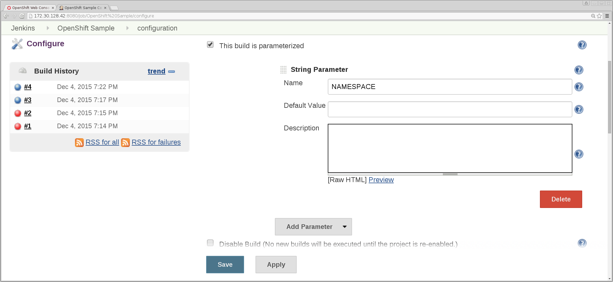
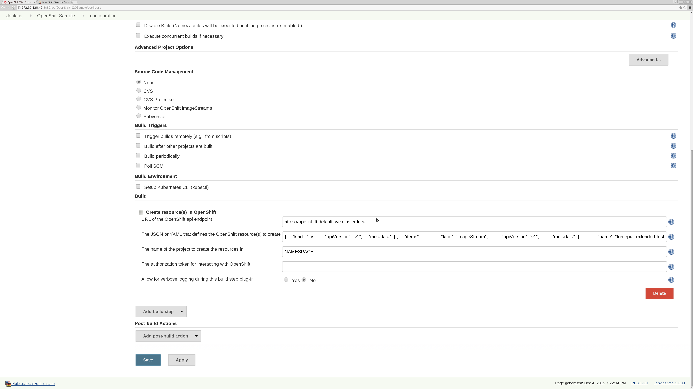
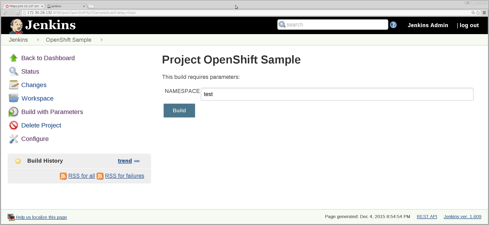

# OpenShift V3 Plugin for Jenkins

***DEPRECATION NOTE***:  This plugin will only support OpenShift versions up to v3.11.  Any OpenShift versions after that will 
require use of the [OpenShift Client Plugin for Jenkins](https://github.com/openshift/jenkins-client-plugin).


This project provides a series Jenkins plugin implementations that operate on [Kubernetes based OpenShift](https://docs.openshift.org/latest/welcome/index.html).  In summary
they are a series of REST flows that interface with the OpenShift server via the [exposed API](https://docs.openshift.org/latest/rest_api/overview.html).
They minimally mimic the REST flows of common uses of the `oc` [CLI command](https://docs.openshift.org/latest/cli_reference/basic_cli_operations.html), but in several
instances additional logic has been added to provide validation of the operations being performed.

Their ultimate intent is to provide easy to use building blocks that simplify the construction of the projects, workflows, and pipelines in Jenkins that operate against OpenShift deployments,
where allowing OpenShift interactions via Jenkins build steps, pipeline DSL, etc. gives those familiar with Jenkins, but new to OpenShift and the `oc` CLI, a better introductory experience.

NOTE:  This plugin does *NOT* require the `oc` binary be present.

NOTE:  This plugin currently does not intend to match feature to feature what is provided via `oc`, but rather expose and augment when possible (additional validations for example) 
OpenShift API REST endpoints, with which the `oc` client also leverages, typically used with CI/CD type flows.  One notable example of an `oc` option that is not exposed in the plugin is the `oc new-app` command.
This omission stems from the fact that there is no single OpenShift server side API for `oc new-app`, and there is a fair amount of client side logic involved.  Rather than invest 
in porting that logic to the plugin, we currently recommend that if `oc new-app` functionality is desired in your Jenkins jobs, either use the OpenShift Jenkins image, where the `oc` binary
is already provided and can be invoked from your Jenkins jobs, or if you are not using the OpenShift Jenkins image, include the `oc` binary in your Jenkins installation.

NOTE: With the above two notes in mind, since this plugin was first envisioned and created, the rapid evolution of both Jenkins (including Pipelines and the introduction of Global Tool Configuration in Jenkins V2) and OpenShift have had an effect on how to best provide OpenShift integration from Jenkins jobs.  The advantages of not requiring the `oc` binary to be included in the Jenkins path have been largely mitigated.  The cost of porting `oc` REST interactions to Java is non-trivial.  And the lack of functionality with client side logic in addition to REST flows, such as seen with `oc new-app` or binary builds, is more of a detriment.

To that end, starting with the 3.7 release of OpenShift, the [OpenShift Client Plugin for Jenkins](https://github.com/openshift/jenkins-client-plugin) is now at GA status, fully supported, and is included in the OpenShift Jenkins images. The plugin is also available from the Jenkins Update Center.  Envisioned as the long term direction for OpenShift integration from Jenkins jobs, among the features provided are:

- A Fluent styled syntax for use in Jenkins Pipelines
- Use of and exposure to any option available with `oc`
- Integration with Jenkins Credentials and Clusters (more features which have solidified since this repository's plugin first arrived)
- Continued support for classic Jenkins Freestyle jobs

Certainly feel free to continue and read about this plugin, but please check out the new plugin at your discretion.  This plugin is still supported, and will continue to be included in the OpenShift Jenkins images.
Consider it as being in maintenance mode, where no new features will be added.

NOTE:  This plugin requires JDK 1.8, based on its maven dependency openshift-restclient-java.

The documentation and code at [https://github.com/openshift/jenkins-plugin](https://github.com/openshift/jenkins-plugin) always hosts the very latest version, including possibly pre-released versions that are still under test.
The associated repository under the JenkinsCI project, [https://github.com/jenkinsci/openshift-pipeline-plugin](https://github.com/jenkinsci/openshift-pipeline-plugin), is only updated as part of cutting 
official releases of this plugin.

For each of those two repositories, this README represents the most technical and up to date description of this plugin's features.  For reference, the associated wiki page for this plugin on the Jenkins site is [here](https://wiki.jenkins-ci.org/display/JENKINS/OpenShift+Pipeline+Plugin).  The most important piece of information on that page will be the indication of the latest officially released version of this plugin.

Some Jenkins job examples which use this plugin and illustrate typical Jenkins / OpenShift integration flows can be found at:
- https://github.com/openshift/origin/blob/master/examples/jenkins/README.md
- https://github.com/openshift/origin/blob/master/examples/jenkins/pipeline/README.md

And overall documentation for the OpenShift Jenkins image (which includes this plugin) is at:
- https://docs.openshift.org/latest/using_images/other_images/jenkins.html
- https://github.com/openshift/jenkins

## Jenkins "build steps"

A series of Jenkins "build step" implementations are provided, which you can select from the `Add build step` pull down available on any project's configure page:

1. "Trigger OpenShift Build": performs the equivalent of an `oc start-build` command invocation, where the build logs can be echoed to the Jenkins plugin screen output in real time; in addition to confirming whether the build succeeded or not, this build step can optionally look to see if any deployment configs have image change triggers for the image produced by the build config; if any such deployment configs are found, those deployments will be analyzed to see if they were triggered by an image change, comparing the image used by the currently running replication controller with the image used by its immediate predecessor.

2. "Scale OpenShift Deployment":  performs the equivalent of an `oc scale` command invocation; the number of desired replicas is specified as a parameter to this build step, and the plugin can optionally confirm whether the desired number of replicas was launched in a timely manner; if no integer is provided, it will assume 0 replica pods are desired.

3. "Trigger OpenShift Deployment":  performs the equivalent of an `oc deploy --latest` command invocation; it will monitor the resulting ReplicationController's "openshift.io/deployment.phase" annotation to confirm success.

4. "Verify OpenShift Service": finds the ip and port for the specified OpenShift service, and attempts to make a HTTP connection to that ip/port combination to confirm the service is up.

5. "Tag OpenShift Image": performs the equivalent of an `oc tag` command invocation in order to manipulate tags for images in OpenShift ImageStream's.

6. "Verify OpenShift Deployment":  determines whether the expected set of DeploymentConfig's, ReplicationController's, and if desired active replicas are present based on prior use of either the "Scale OpenShift Deployment" (2) or "Trigger OpenShift Deployment" (3) steps; its activities specifically include:

   - it first confirms the specified deployment config exists.
   - it then gets the list of all replication controllers for that DC, and determines which replication controller is the latest generation/incarnation of the deployment.
   - and then sees for the latest replication controller if a) the deployment phase annotation "openshift.io/deployment.phase" is marked as "Complete" within a (configurable) time interval, and then optionally b) if within a configurable time the current replica count is at least equal to the desired replica count.
   - NOTE: success with older incarnations of the replication controllers for a deployment is not sufficient for this Build Step; the state of the latest generation is what is verified.
   - NOTE: overriding of timeouts is detailed below.


7. "Verify OpenShift Build":  performs the equivalent of an 'oc get builds` command invocation for the provided build config key provided; once the list of builds are obtained, the state of the latest build is inspected to see if it has completed successfully within a reasonable time period; it will also employ the same deployment triggering on image change verification done in the "Trigger OpenShift Build" build step; this build step allows for monitoring of builds either generated internally or externally from the Jenkins Project configuration.  NOTE: success or failure of older builds has no bearing; only the state of the latest build is examined.

8. "Create OpenShift Resource(s)":  performs the equivalent of an `oc create` command invocation; this build step takes in the provided JSON or YAML text, and if it conforms to OpenShift schema, creates whichever OpenShift resources are specified.

	- NOTE: if a namespace is specified in the provided json/yaml for any of the resources, that namespace will take precedence over the namespace specified in the "The name of the project to create the resources in" field.  However, the authorization token provided in the field "The authorization token for interacting with OpenShift" must have edit permission to any project/namespace referenced in the json/yaml.  If no token is specified, the assumption is that Jenkins in running in OpenShift, and the default service account associated with the project/namespace Jenkins is running in has edit permission to any project/namespace referenced in the json/yaml.

9. "Delete OpenShift Resource(s)...":  performs the equivalent of an `oc delete` command invocation; there are 3 versions of this build step; one takes in provided JSON or YAML text, and if it conforms to OpenShift schema, deletes whichever OpenShift resources are specified; the next form takes in comma delimited lists of types and keys, and deletes the corresponding entries; the last form takes in a comma separated list of types, along with comma separated lists of keys and values that might appear as labels on the API resources, and then for each of the types, deletes any objects that have labels that match the key/value pair(s) specified. 

	- NOTE: if a namespace is specified in the provided json/yaml for any of the resources, that namespace will take precedence over the namespace specified in the "The name of the project to create the resources in" field.  However, the authorization token provided in the field "The authorization token for interacting with OpenShift" must have edit permission to any project/namespace referenced in the json/yaml.  If no token is specified, the assumption is that Jenkins in running in OpenShift, and the default service account associated with the project/namespace Jenkins is running in has edit permission to any project/namespace reference in the json/yaml.

## Jenkins "Source Code Management (SCM)"

An implementation of the Jenkins SCM extension point is also provided that takes advantage of Jenkins' built in polling and version management capabilities, but within the context of OpenShift Image Streams (we have taken the liberty of broadening the scope of what is considered "source"):

1. "OpenShift ImageStreams": the aforementioned baked-in polling mechanism provided by Jenkins is leveraged, exposing the common semantics between OpenShift ImageStreams (which are abstractions of Docker repositories) and SCMs; image IDs are maintained and treated like commit IDs for the requisite artifacts (images under the ImageStream instead of programmatic source files); when the image IDs for specific tags provided change (as reflected by updated "commit IDs" reported to Jenkins through the SCM plugin contract), Jenkins will initiate a build for the Project configuration in question; note, there are no "extractions" of any sort which leverage the workspaces provided by Jenkins to the SCMs.  It is expected that the build steps in the associated project configuration will initiate any OpenShift related activities that were dependent on the ImageStream resource being monitored.

## Jenkins "post-build actions"

A few Jenkins "post-build action" implementations are also provided, which you can select from the `Add post-build action` pull down available on any project's configure page:

1. "Cancel OpenShift Builds":  this action is intended to provide cleanup for a Jenkins project which failed because a build is hung (instead of terminating with a failure code); this step will allow you to perform the equivalent of a `oc cancel-build` for any builds found for the provided build config which are not previously terminated (either successfully or unsuccessfully) or cancelled; those builds will be cancelled.

2. "Cancel OpenShift Deployment": this action is intended to cleanup any OpenShift deployments which still in-progress after the Build completes;  this step will allow you to perform the equivalent of a `oc deploy --cancel` for the provided deployment config.

3. "Scale OpenShift Deployment":  performs the equivalent of an `oc scale` command invocation; the number of desired replicas is specified as a parameter to this build step, and the plugin can optionally confirm whether the desired number of replicas was launched in a timely manner; if no integer is provided, it will assume 0 replica pods are desired.  And yes, it is equivalent to the "Scale OpenShift Deployment" build step listed above.

## Jenkins Pipeline (formerly Workflow) Plugin

### DSL

Starting with version 1.0.14 of the OpenShift Pipeline Plugin, the "build steps" are now accessible via the Jenkins Pipeline Plugin Step API for creating DSL extensions for the Pipeline Plugin.
This Pipeline DSL is the replacement for the Java object instantiation within the Pipeline Groovy scripts noted below.

For each of the DSLs, you can still instantiate the various steps and assign to a variable, however you no longer need to pass it to the `step` method (execution will commence immediately after the step is created).  This is shown in the following example:

`def builder = openshiftBuild buildConfig: 'frontend'`

NOTE:  the Pipeline Plugin "Snippet Generator" creates Groovy of this form.

You can also create the step without assigning it to a variable and allow the automatic execution to commence.  This is shown in the following example:

`openshiftBuild(buildConfig: 'frontend')`

Here is the complete DSL reference for the OpenShift Pipeline Plugin.

####  Optional parameters that apply to all the DSL steps:

- "apiURL":  URL of the OpenShift api endpoint.  If nothing is specified, the plugin will inspect the KUBERNETES_SERVICE_HOST environment variable. If that variable is not set, the plugin will attempt to connect to "https://openshift.default.svc.cluster.local".
- "namespace":  The name of the project the BuildConfig is stored in.  If nothing is specified, the plugin will inspect the PROJECT_NAME environment variable.
- "authToken":  The authorization token for interacting with OpenShift.  If you do not supply a value, the plugin will assume it is running in the OpenShift Jenkins image and attempt to load the kubernetes service account token stored in that image.
- "verbose":  Allow for verbose logging during this build step plug-in.  Set to `true` to generate the additional logging.

####  "Trigger OpenShift Build"

The step name is "openshiftBuild".  Mandatory parameters are:

- "buildConfig" or "bldCfg":  The name of the BuildConfig to trigger.  NOTE: both names work with scripted pipelines, but only "bldCfg" works with declarative pipelines.

Optional parameters are:

- "buildName":  The name of a previous build which should be re-run.  Equivalent to specifying the `--from-build` option when invoking the OpenShift `oc start-build` command.
- "commitID":  The commit hash the build should be run from.  Equivalent to specifying the `--commit` option when invoking the OpenShift `oc start-build` command.
- "env": An array of environment variables for the build (e.g. `env : [ [ name : 'name1', value : 'value1' ], [ name : 'name2', value : 'value2' ] ]`.
- "showBuildLogs":  Pipe the build logs from OpenShift to the Jenkins console.
- "checkForTriggeredDeployments":  Verify whether any deployments triggered by this build's output fired.
- "waitTime":  Time in milliseconds to wait for build completion.  Default is 15 minutes.

#### "Trigger OpenShift Deployment"

The step name is "openshiftDeploy".  Mandatory parameters are:

- "deploymentConfig" or "depCfg":  The name of the DeploymentConfig to trigger.  NOTE: both names work with scripted pipelines, but only "depCfg" works with declarative pipelines.

Optional parameters are:

-  "waitTime":  Time in milliseconds to wait for deployment completion.  Default is 10 minutes.

#### "Run OpenShift Exec"

The step name is "openshiftExec".  Mandatory parameters are:

-  "pod" : The name of the pod in which to execute the command.
-  "command" :  The name of the command to run. May be specified as `command: '/usr/bin/echo'` or in a compact form including parameters as `command: [ '/usr/bin/echo', 'hello', 'world', ... ]` 

Optional parameters are:

- "container" : The container name in which to run the command. If not specified, the first container in the pod will be used.
-  "arguments" : Arguments for the command. May be specified as `arguments: [ 'arg1', 'arg2', ... ]` or `arguments: [ [ value: 'arg1' ], [ value : 'arg2' ], ... ]` 
-  "waitTime" :  Time in milliseconds to wait for deployment completion.  Default is 3 minutes.

The object returned exposes the following attributes:

- stdout : All standard out received from the exec API.
- stderr : All standard error received from the exec API.
- error : A string describing any execution errors from the exec API (e.g. command not found in pod PATH).
- failure : A string describing any low level failure to execute the exec API (e.g. protocol level errors).

All attributes are empty strings by default. As the exec API delivers messages (e.g. individual lines
of standard output), each message will be appended to the respective result attribute and followed by a linefeed.

```
    def response = openshiftExec( ... command: 'echo', arguments : [ 'hello', 'world' ] ... )
    if ( response.error == "" && response.failure == "" ) {
        println('Stdout: '+response.stdout.trim())
        println('Stderr: '+response.stderr.trim())
    } else {
        ...
    }
    
```

It should be evident from the above example that "errors" and "failures" **returned by the Exec API** 
are exposed to the caller by the response object and do not, therefore, terminate the Jenkins 
build. This allows the caller to programmatically handle some failure conditions.
 
Other failure conditions where the API cannot be executed or its result ascertained (timeouts or 
an inability to find the specified Pod) will be treated as fatal errors and terminate the Jenkins
build with an error.

When used as a step in a Freestyle job, the Exec operation does not distinguish between these 
categories of failure. Since outcomes cannot be handled programmatically in a freestyle
job, all failures will result in the termination of the Jenkins build.


#### "Create OpenShift Resource(s)"

The step name is "openshiftCreateResource".  Mandatory parameters is either:

- "json", "yaml", or "jsonyaml": The JSON or YAML representation of the OpenShift resources.  Note, the plugin does not care if YAML is provided under the "json" key or vice-versa.  As long
as the string passes either the JSON or YAML format checking, it will be processed.  NOTE: all these names work with scripted pipelines, but only "jsonyaml" works with declarative pipelines.

#### "Delete OpenShift Resource(s) from JSON/YAML"

The step name is "openshiftDeleteResourceByJsonYaml".  Mandatory parameters is either:

- "json", "yaml", or "jsonyaml": The JSON or YAML representation of the OpenShift resources.  Note, the plugin does not care if YAML is provided under the "json" key or vice-versa.  As long
as the string passes either the JSON or YAML format checking, it will be processed.  NOTE: all these names work with scripted pipelines, but only "jsonyaml" works with declarative pipelines.

####  "Delete OpenShift Resource(s) using Labels"

The step name is "openshiftDeleteResourceByLabels".  Mandatory parameters are:

-  "types":  The type(s) of OpenShift resource(s) to delete.  Provide a comma-separated list.

-  "keys":  The key(s) of labels on the OpenShift resource(s) to delete.  Provide a comma-separated list.

-  "values":  The value(s) of labels on the OpenShift resource(s) to delete.  Provide a comma-separated list.

####  "Delete OpenShift Resource(s) by Key"

The step name is "openshiftDeleteResourceByKey".  Mandatory parameters are:

- "types":  The type(s) of OpenShift resource(s) to delete.  Provide a comma-separated list.

- "keys":  The key(s) of the OpenShift resource(s) to delete.  Provide a comma-separated list.

####  "Scale OpenShift Deployment"

The step name is "openshiftScale".  Mandatory parameters are:

- "deploymentConfig" or "depCfg":  The name of the DeploymentConfig to scale.  NOTE: both names work with scripted pipelines, but only "depCfg" works with declarative pipelines.

- "replicaCount":  The number of replicas to scale to.

Optional parameters are:

- "verifyReplicaCount":  Verify whether the specified number of replicas are up.  Specify `true` or `false`.

- "waitTime":  The amount of time in milliseconds to see whether the specified number of replicas have been reached.  Default is 3 minutes.

####  "Tag OpenShift Image"

The step name is "openshiftTag".  Mandatory parameters are:

-  "sourceStream" or "srcStream":  The ImageStream of the existing image.    NOTE: all these names work with scripted pipelines, but only "srcStream" works with declarative pipelines.

-  "sourceTag" or "srcTag":  The tag (ImageStreamTag type) or ID (ImageStreamImage type) of the existing image. NOTE: all these names work with scripted pipelines, but only "srcTag" works with declarative pipelines.

-  "destinationStream" or "destStream":  The ImageStream for the new tag. A comma delimited list can be specified.  NOTE: all these names work with scripted pipelines, but only "destStream" works with declarative pipelines.

-  "destinationTag" or "destTag":  The name of the new tag. A comma delimited list can be specified.  NOTE: all these names work with scripted pipelines, but only "destTag" works with declarative pipelines.

    The following combinations are supported:
    1. 1 destination stream and 1 destination tag   (i.e. single tag applies to single stream)
        - `destinationStream: 'stream1', destinationTag: 'tag1'`
    1. 1 destination stream and N destination tags   (i.e. all tags apply to the same stream)
        - `destinationStream: 'stream1', destinationTag: 'tag1, tag2'`
    1. 1 destination tag and N destination streams	(i.e. all streams will get the same tag)
        - `destinationStream: 'stream1, stream2', destinationTag: 'tag1'`
    1. N destination streams and N destination tags	(i.e. each index will be combined to form a unique stream:tag combination)
        - `destinationStream: 'stream1, stream2', destinationTag: 'tag1, tag2'`

Optional parameters are:

- "namespace" : Namespace of the source ImageStream (If Jenkins is running within OpenShift, defaults to the namespace in which Jenkins is running).

-  "alias":  Whether to update destination tag whenever the source tag changes.  Equivalent of the `--alias` option for the `oc tag` command. When false, the destination tag type is "ImageStreamImage", and when true, the destination tag type is "ImageStreamTag".

-  "destinationNamespace":  The name of the project to host the destinationStream:destinationTag.  If nothing is specified, the plugin will use the source namespace.

-  "destinationAuthToken":  The authorization token for interacting with the destinationNamespace.  If you do not supply a value, the plugin will assume it is running in the OpenShift Jenkins image and attempt to load the kubernetes service account token stored in that image.

####  "Verify OpenShift Build"

The step name is "openshiftVerifyBuild".  Mandatory parameters are:

- "buildConfig" or "bldCfg":  The name of the BuildConfig to verify.  NOTE: both names work with scripted pipelines, but only "bldCfg" works with declarative pipelines.

Optional parameters are:

- "checkForTriggeredDeployments":  Verify whether any deployments triggered by this build's output fired.
- "waitTime":  Time in milliseconds to wait for build completion.  Default is 1 minute.

#### "Verify OpenShift Deployment"

The step name is "openshiftVerifyDeployment".  Mandatory parameters are:

-  "deploymentConfig" or "depCfg":  The name of the DeploymentConfig to scale.  NOTE: both names work with scripted pipelines, but only "depCfg" works with declarative pipelines.

Optional parameters are:

- "replicaCount":  The number of replicas to scale to.

- "verifyReplicaCount":  Verify whether the specified number of replicas are up.  Specify `true` or `false`.

- "waitTime":  The amount of time in milliseconds to see whether the specified number of replicas have been reached.  Default is 3 minutes.

####  "Verify OpenShift Service"

The step name is "openshiftVerifyService".  Mandatory parameters are:

- "serviceName" or "svcName":  The name of the service to connect to.  NOTE: both names work with scripted pipelines, but only "svcName" works with declarative pipelines.

Optional parameters are:

- "retryCount":  The number of times to attempt a connection before giving up.  The default is 100.

####  "ImageStreams SCM"

This step associates a pipeline with an ImageStream as its SCM. With polling enabled on a job,
this allows a pipeline job to be launched automatically whenever a new image is tagged on an 
ImageStream.

NOTE:  with the advent of OpenShift Pipeline Build Strategy, incorporating your pipeline into
such a BuildConfig along with the use of an Image Change Trigger is the better choice for 
triggering pipeline jobs from changes to ImageStreams in OpenShift. 

The step name is "openshiftImageStream". Mandatory parameters are:

- "name":  The name of the ImageStream to poll

- "tag":  The tag to watch on the ImageStream

- "namespace": The project for the ImageStream


### Pipeline / Workflow support prior to version 1.0.14 of the OpenShift Pipeline Plugin 

Each of the Jenkins "build steps" can also be used as steps in a Jenkins Pipeline / Workflow plugin Groovy script, as they implement `jenkins.tasks.SimpleBuildStep` and `java.io.Serializable`.  From your Groovy script, instantiate the associated Java object, and then leverage the workflow plugin `step` keyword to call out to the object with the necessary workflow contexts.  [Here](https://github.com/jenkinsci/workflow-plugin/blob/master/TUTORIAL.md) is a useful reference on constructing Jenkins Workflow Groovy scripts.

As a point of reference, here are the Java classes for each of the Jenkins "build steps":
1.  "Trigger OpenShift Build":  com.openshift.jenkins.plugins.pipeline.OpenShiftBuilder

2.  "Scale OpenShift Deployment":  com.openshift.jenkins.plugins.pipeline.OpenShiftScaler

3.  "Trigger OpenShift Deployment":  com.openshift.jenkins.plugins.pipeline.OpenShiftDeployer

4.  "Verify OpenShift Service":  com.openshift.jenkins.plugins.pipeline.OpenShiftServiceVerifier

5.  "Tag OpenShift Image":  com.openshift.jenkins.plugins.pipeline.OpenShiftImageTagger

6.  "Verify OpenShift Deployment":  com.openshift.jenkins.plugins.pipeline.OpenShiftDeploymentVerifier

7.  "Verify OpenShift Build":  com.openshift.jenkins.plugins.pipeline.OpenShiftBuildVerifier

8.  "Create OpenShift Resource(s)":  com.openshift.jenkins.plugins.pipeline.OpenShiftCreator

9.  "Delete OpenShift Resource(s)...":   com.openshift.jenkins.plugins.pipeline.OpenShiftDeleterJsonYaml, com.openshift.jenkins.plugins.pipeline.OpenShiftDeleterList, com.openshift.jenkins.plugins.pipeline.OpenShiftDeleterLabels

## Common aspects across the REST based functions (build steps, SCM, post-build actions)

### Authorization

In order for this plugin to operate against OpenShift resources, the OpenShift service account for the project(s) being operated against will need to have the necessary role and permissions.  In particular, you will need to add the `edit` role to the service account in the project those resources are located in.  

For example, in the case of the `test` project, the specific command will be:  `oc policy add-role-to-user edit system:serviceaccount:test:<service account name>`

If that project is also where Jenkins is running out of, and hence you are using the OpenShift Jenkins image (https://github.com/openshift/jenkins), then the bearer authorization token associated with that service account is already made available to the plugin (mounted into the container Jenkins is running in at "/run/secrets/kubernetes.io/serviceaccount/token").  So you don't need to specify it in the various build step config panels.

Next, in the case of "Tag OpenShift Image", you could potentially wish to access two projects (the source and destination image streams can be in different projects with `oc tag`).  If so, then either the service account token which Jenkins is running under, the "source" token, needs edit access to both projects, or you need to supply an additional token (most likely a service account in the second project) with edit access to the second/destination project and at least view access to the first/source project.

Consider the scenario where the source image stream is in the project `test` and the destination image stream is in project `test2`.  Then try these two commands:

-  `oc policy add-role-to-user edit system:serviceaccount:test:<service account name> -n test2`
-  `oc policy add-role-to-user edit system:serviceaccount:test2:<service account name> -n test`

A similar situation also applies for creating or deleting resources via JSON/YAML.  A namespace/project which differs from the namespace set for the build step could be specified for any of the resources in the JSON/YAML.  If so, similar `oc policy` invocations
to add the edit role for any of those namespaces listed in the JSON/YAML will be needed.

Finally, for any of the build steps, outside of the previously mentioned mounting of the token for the project's `default` service account into the OpenShift Jenkins image container (assuming OpenShift brings up your Jenkins server), the token can be provided by the user via the following:

- the field for the token in the specific build step
- if a string parameter with the key of `AUTH_TOKEN` is set in the Jenkins Project panel, where the value is the token
- if a global property with the key of `AUTH_TOKEN` is set in the `Manage Jenkins` panel, where the value is the token

Per the OpenShift documentation, see the commands `oc describe serviceaccount default` and `oc describe secret <secret name>` for obtaining actual token strings.

### Certificates and Encryption

For the certificate, when running in the OpenShift Jenkins image, the CA certificate by default is pulled from the well known location ("/run/secrets/kubernetes.io/serviceaccount/ca.crt") where OpenShift mounts it, and then is stored into the Java KeyStore and X.509 TrustManager for subsequent verification against the OpenShift server on all subsequent interactions.  If you wish to override the certificate used:

- Option 1:  set a either a project specific build parameter or global key/value property named `CA_CERT_FILE` to the file location of the certificate
- Option 2: For all steps of a given project, set a build parameter (again, of type `Text Parameter`)  named `CA_CERT` to the string needed to construct the certificate.  Since `Text Parameter` input fields are not available with the global key/value properties, the plug-in does not support defining certificates via a `CA_CERT` property across Jenkins projects.

If you want to skip TLS verification and allow for untrusted certificates, set the named parameter `SKIP_TLS` to any value other than `false`.  Since this can be done with a Jenkins `String Parameter`, you can use this at either the global or project level. 


### Providing parameter values

For each of the steps and actions provided, with each required parameter, a default value will be inferred whenever possible if the field is left blank (specifics on this are further down in this section).  Optional parameters can be left blank as well.  And each parameter field has help text available via clicking the help icon located just right of the parameter input field.

Also, when processing any provided values for any of the parameters, the plugin will first see if that value, when used as as key, retrieves a non-null, non-empty value from the Jenkins build environment parameters.  If so, the plugin will substitute that value retrieved from the Jenkins build environment parameters in place of what was provided in the input field.

Here are a couple of screen shots to help illustrate.  First, the definition of the parameter:

<p align="center">

</p>

Then how a build step could consume the parameter:

<p align="center">

</p>

And then how you would run the project, specifying a valid value for the parameter:
<p align="center">

</p>

An examination of the configuration fields for each type of the build steps will quickly discover that there are some common configuration parameters across the build steps.  These common parameters included:
- the URL of the OpenShift API Endpoint
- the name of the OpenShift project
- whether to turn on verbose logging (off by default)
- the bearer authentication token

For the API Endpoint and Project name, any value specified for the specific step takes precedence.  That value can be either the actual value needed to connect, or as articulated above, a Jenkins build environment parameter.  But if no value is set, then OpenShift Pipeline plugin will inspect the environment variable available to the OpenShift Jenkins image (where the name of the variable for the endpoint is `KUBERNETES_SERVICE_HOST` and for the project is `PROJECT_NAME`).  In the case of the API Endpoint, if a non-null, non-empty value is still not obtained after checking the environment variable, the plugin will try to communicate with "https://openshift.default.svc.cluster.local".  With the Project name, if neither a specific value is specified or `PROJECT_NAME` is not set, then the plugin will see if it is running within a Pod where the namespace will be mounted in the file `/run/secrets/kubernetes.io/serviceaccount/namespace`.

Note that with the "OpenShift ImageStreams" SCM plug-in, these environment variables will not be available when running in the background polling mode (though they are available when that step runs as part of an explicit project build).

Also, when referencing parameters in the build step fields, the following forms
can be used:
- the name as is; for example, for the parameter `VERSION`, you can use `VERSION` in the field
- the name preceded with a `$`; for the parameter `VERSION`, you can use `$VERSION` in the field
- the name encapsulated with `${..}`; for the parameter `VERSION`, you can use `${VERSION}` in the field
- the name ecapsulated with `${..}` and combined with some constant text; for the parameter `VERSION`, you can specify `myapp-${VERSION}` in the field 


### Communication Timeouts 

The default timeouts for the various interactions with the OpenShift API endpoint are also configurable for those steps that have to wait on results.  Overriding the timeouts are currently done globally across all instances of a given build step or post-build step.  Go to the "Configure System" panel under "Manage Jenkins" of the Jenkins UI (i.e. http://<host:port>/configure), and then change the "Wait interval" for the item of interest.  Similarly, the OpenShift Service Verification has a retry count for attempts to contact the OpenShift Service successfully.

## Build and Install

Like the Jenkins project itself, this project is a maven based project.  To build this project, after you install maven and java 1.8 or later, and cd to this projects root directory (where the `pom.xml` file is located), run `mvn clean package`.  If built successfully, and `openshift-pipeline.hpi` file will reside in the `target` subdirectory.

Aside from building the plugin locally, there are a few other ways to obtain built version of the plugin:

1.  The Centos and RHEL versions of the OpenShift Jenkins Docker Image, starting officially with V3.2 of OpenShift, will have the plugin installed.  See the [Jenkins Docker Image repository](https://github.com/openshift/jenkins) for details. 

2.  As noted earlier, [wiki page](https://wiki.jenkins-ci.org/display/JENKINS/OpenShift+Pipeline+Plugin) has a link to the latest official version of the plugin.

3.  You could also go to the [openshift-pipeline page](https://updates.jenkins-ci.org/download/plugins/openshift-pipeline/) at the Jenkins Update Center to view the complete list of released plugins.

4.  The Jenkins server used for OpenShift development has a [job](https://ci.openshift.redhat.com/jenkins/job/openshift-pipeline-plugin/) that build the latest commit to the master repo.  The resulting `openshift-pipeline.hpi` file be a saved artifact from that job.

5.  A RHEL RPM is also available as of V3.2 of OpenShift.

Unless you are using a OpenShift Jenkins Docker Image with the plugin preinstalled, follow the Jenkins instructions for installing a plugin either by supplying the `openshift-pipeline.hpi` file, or by pulling it down from the Jenkins Update Center. 
